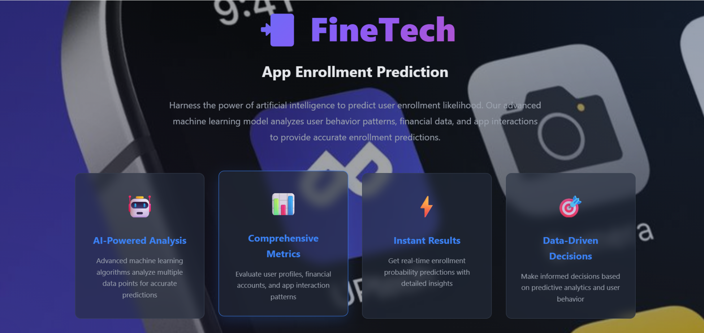
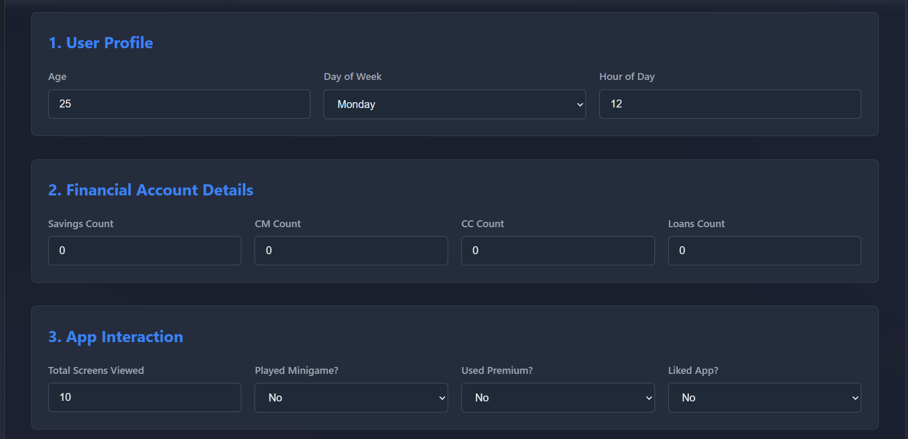
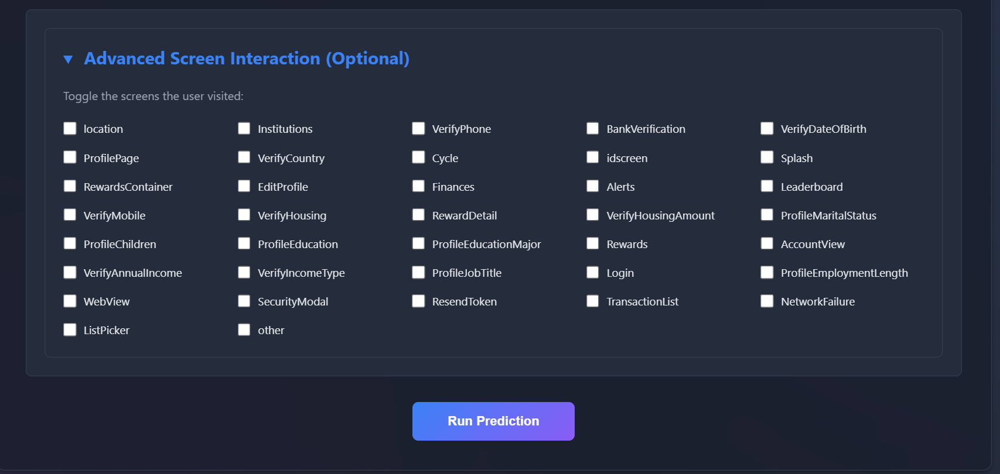

#  FineTech – App Enrollment Prediction using Machine Learning

FineTech is an advanced AI-driven Machine Learning web application built to predict the likelihood of a user enrolling in a financial technology platform. By intelligently analyzing a combination of demographic attributes, financial account indicators, and in-app behavioral interactions, FineTech generates accurate enrollment probability scores. This enables businesses to gain deeper user insights, optimize engagement strategies, and make data-informed decisions to improve customer acquisition and retention.

---

#  Project Overview

FineTech helps financial platforms understand user intent by evaluating:

- User profile attributes (age, time of app usage)
- Financial product ownership (savings, credit cards, loans)
- In-app engagement patterns (screens viewed, premium usage)
- Advanced screen navigation behavior

The system outputs:

✅ Enrollment likelihood  
✅ Probability score  

---

#  Key Highlights

-  **AI-Based Enrollment Prediction**
-  **Comprehensive Financial & Behavioral Metrics**
-  **Instant Real-Time Results**
-  **Data-Driven Business Decision Support**
-  **Modern Flask-Based Interactive UI**
-  **Advanced Screen Interaction Tracking (Optional)**

---

# 🖼️ Project Screenshots

## Landing Page

## User Input Dashboard

##  Advanced Screen Interaction Selection

##  Prediction Result Output

---

#  Tech Stack

## Programming & ML
- Python  
- Pandas, NumPy  
- Scikit-learn
- Matplotlib

## Web Development
- Flask  
- HTML5 
- CSS3 

## Model Deployment
- Flask Web Application Integration  

---

# Dataset Description

The dataset contains user app behavior and financial activity information such as:

- Age  
- Day of Week & Hour of App Usage  
- Savings Account Count  
- Credit Card & Loan Count  
- Total Screens Viewed  
- Premium Feature Usage  
- User Feedback (Liked App / Played Minigame)  
- Detailed Screen Interaction History  

---

#  Machine Learning Pipeline

1. Data Cleaning & Preprocessing  
2. Feature Engineering & Encoding  
3. Train-Test Split  
4. Model Training & Evaluation  
5. Probability Score Prediction  
6. Deployment via Flask Web Interface  

---

## Results

Using the **Logistic Regression** model, we achieved an accuracy of approximately **77%** in predicting user enrollment behavior.

This demonstrates that the model is able to effectively distinguish between users who are likely to subscribe and those who may require additional marketing efforts or promotional offers.
