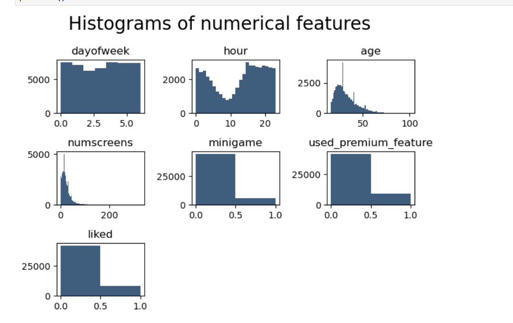

# Guiding Customers Through App Behavior Analysis

## Introduction

In today’s competitive market, many companies offer free features in their mobile applications for a limited period to encourage users to eventually purchase a **premium subscription**.

To maximize conversions, businesses should focus their marketing efforts on users who have already tried the app but have not yet subscribed. Offering discounts to this group is more effective than targeting users who are already likely to enroll.

In this project, we build a **machine learning model** that predicts which users are unlikely to subscribe to the paid plan, allowing companies to better allocate promotional resources.

---

## Dataset

The dataset used in this project comes from a fintech company offering a paid mobile subscription that helps users manage and track their financial activities in one platform.

The company provides a free version with limited functionality and wants to identify users who are less likely to upgrade, so special offers can be directed toward them instead of all customers.

The dataset contains **50,000 user records** with **12 features**, including the target variable representing enrollment status.

### Dataset Features

| Column Name            | Description |
|------------------------|-------------|
| **user**              | Unique user identifier |
| **first_open**        | Timestamp of the user’s first app launch |
| **dayofweek**         | Day index when the app was first opened |
| **hour**              | Hour of the first app session |
| **age**               | User age |
| **screen_list**       | List of screens visited during app usage |
| **numscreens**        | Total number of screens viewed |
| **minigame**          | Whether the user played the mini game (1 = Yes, 0 = No) |
| **liked**             | Whether the user liked the app on the store |
| **used_premium_feature** | Whether premium features were accessed |
| **enrolled**          | Target variable: enrolled in paid plan (1) or not (0) |
| **enrolled_date**     | Date of subscription enrollment |

---

## Histograms

### Key Observations

- **dayofweek** shows an almost uniform distribution across all days.  
- **hour** drops significantly between **2 AM and 10 AM**, as most users are inactive during sleeping hours.  
- **age** indicates most users fall between **20–40 years**, with peaks around **30 and 40**.  
- **numscreens** is left-skewed, with most users viewing around **20–30 screens**.  
- **minigame** reveals that the majority of users did not play the mini game.  
- **used_premium_feature** suggests most users did not try premium features.  
- **liked** shows fewer users liked the app on the store.  

---

## Correlation with Target Variable

### Feature Relationships with Enrollment

- **dayofweek** has minimal impact due to its balanced distribution.  
- **hour** has a negative correlation, meaning earlier usage times slightly increase enrollment likelihood.  
- **age** shows younger users tend to subscribe more often.  
- **numscreens** has a positive correlation — higher engagement leads to higher enrollment probability.  
- **minigame** participation slightly increases subscription chances.  
- **used_premium_feature** unexpectedly shows a decrease in enrollment probability.  
- **liked** also slightly decreases enrollment, though the correlation is very small.  

---

## Correlation Matrix

### Insights

- No pair of features shows a correlation greater than **±0.1**.  
- The strongest relationship appears between **minigame** and **used_premium_feature**.  
- Since there are no strong linear dependencies, feature removal is unnecessary.  

---

## Feature Engineering

### Response Time

To ensure the model remains useful for future predictions, we define a time window after the first app usage to determine whether a user enrolls.

Response time is calculated by subtracting the first open timestamp from the enrollment timestamp.

We set a threshold of **48 hours (2 days)**. Users who do not subscribe within this period are treated as non-enrolled for model evaluation.

---

### Screen List Processing

The **screen_list** feature contains multiple screens visited by users in one column.

We convert this list into separate screen-based features grouped into categories such as:

- **Savings**
- **Loans**
- **Credit**
- **Other Screens**

---

## Results

Using the **Logistic Regression** model, we achieved an accuracy of approximately **77%** in predicting user enrollment behavior.

This demonstrates that the model is able to effectively distinguish between users who are likely to subscribe and those who may require additional marketing efforts or promotional offers.
